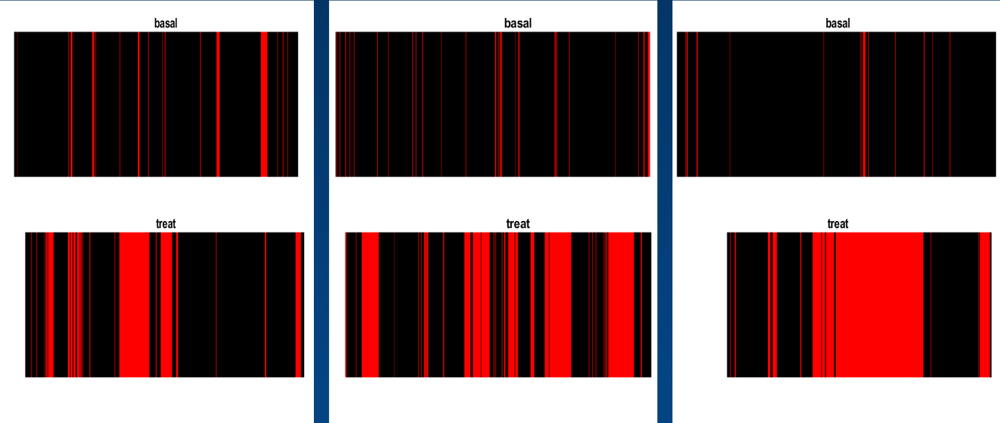

# ACA project

pose analysis algorithm (Alignment Cluster Analysis) research works


----

### Algorithm


**Core Concept** :  KKM(kernel k-means), DTAK(Dynamic Time-Alignment Kernel), DP for optimization

**More Details** : [Method intro](./misc/Unsupervised Discovery of Facial Events summary.pdf)

**Reference** : 

[original code](https://github.com/zhfe99/aca)

```
[1] F. Zhou, F. de la Torre, and J. K. Hodgins, "Aligned cluster analysis for temporal segmentation of human motion," in International Conference on Automatic Face and Gesture Recognition (FG), 2008.

[2] F. Zhou, F. de la Torre, and J. K. Hodgins, "Hierarchical Aligned cluster analysis for temporal segmentation of human motion," submitted to IEEE Transactions on Pattern Analysis & Machine Intelligence (PAMI), 2010.
```


----

### Work 1: Rearrangement

In [aca_simp](./aca-simp) folder:

* comment : some unused code that had been implemented in c++
* cpp : C++ files that can be transfrom into mexw64 file for matlab

* func1 : mexw64 files used
* func2 : similarity distance counting functions
* func3 : clustering and segment initialize functions
* func4 : ACA optimization functions (coordinate descent strategy)
* func5 : my analysis and tool functions based on original
* func6 : my plot and video result generation functions


----

### Work 2: Feature Extraction

In [feat](./feat) folder, preprocess features generate from landmark of mice (DeepLabCut) and try to extract representative pose feature by using distances, angles, SOM map class, PCA reduction features and Autoencoder reduction features.

> landmarks from DeepLabCut
> 


----

### Work 3: Key motion analysis

Based on analysis of mice pose data, find out the pose with largest amount difference then analyze whether the key motion between different dataset had the same features.

> finding key motion by comparing cluster of basal data(health mice) and treat data (pain mice) 
>

> key motion clips in video
>
> 

----

### Work 4: Improve the cluster result

Using short video and hand video to observe what the algorithm have learned and tuning the feature extraction method to get better clustering result.


**Future work** : Adding landmarks moving speed as weights for DTAK distance evaluation (To make ACA be more sensitive to fast movements)


----

### Work 5:  Different run of cluster alignment

ACA can not load too many data in one run (The similarity matrix for clustering may cost lots of memory). And for different runs, the ACA generate different cluster based on different data. There are two ways I tried to issue this problem.

1. Finding the cluster center and compute the distances of data from different dataset to the cluster center. (It fails due to the transform of spectral clustering makes the cluster center not representative)
2. Recluster again by segments from ACA results. The recluster step breaks down the process so that we only need the similarity matrix of segments rather than similarity matrix of frames. (It also fail due to the spectral clustering is not able to cluster well for large amount of data)


----

### Work 6: Python version (terminated)

The method were trying to utilize in the clinic of mice. So the project should be packaged into Application. But the implementation were not complete. The there are some tricks in ACA such as spectral cluster and C++ implementation that needs a lot more time to complete the transformation. 


----

### Summary

The project was terminated due to the drawbacks that mentioned in Work5 and the preliminary analysis on mice data seems the motion information is not strongly relative with the mice emotion.
